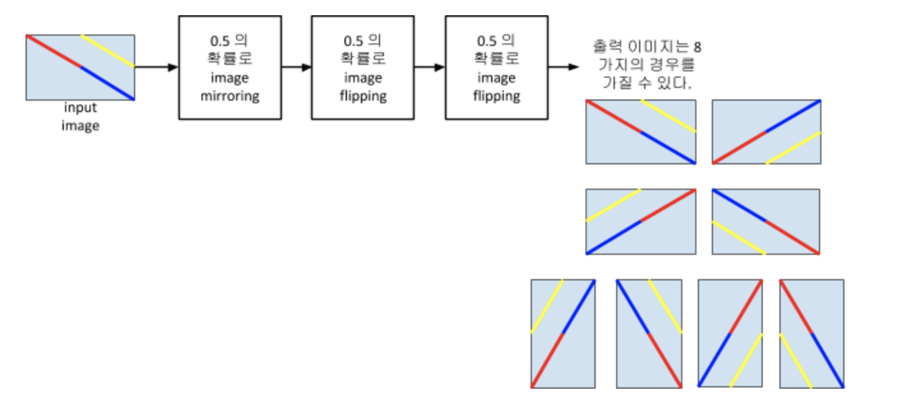
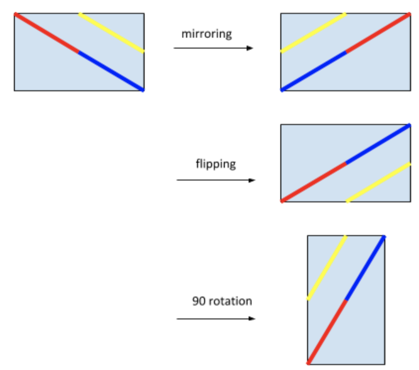

# Image Cut and Paste
## 마인즈랩 코딩테스트

* 이 문제를 풀기 위해 어떠한 opensource 또는 package 를 사용해도 상관없습니다.  심지어 만약 이 문제에 대한 답을 인터넷에서 찾았을 경우, 그것을 제출하셔도 됩니다. 그러나, 정확히 같은 문제인지는 확인을 해야 합니다.

* 두개의 code 를 작성한다.  어떠한 language 도 상관없음. 여기서는 Python 으로 설명함.
    * cut_image.py 와 merge_image.py. 이름은 마음대로 정해도 상관없음.
    * cut_image.py 와 merge_image.py 를 한꺼번에 돌리고 test automation을 위한 shell script 를 작성(optional)

* cut_image.py
    * 사용방법: `cut_image.py ${image_file_name} ${column_number}  ${row_number} ${prefix_output_filename}`
    * 예를 들어 cut_image_py 3 4 test 를 수행시키면 모두 12 개의 이미지가 출력되며, 그 12 개 이미지의 이름은 test_1.jpg, test_2.jpg, … , test_12.jpg 이다. 코드는 입력 이미지를 3 x 4 로 자른 이후, random 하게 (0.5 의 확률로) mirroring, flipping, 90 degree rotation 을 진행한다.  아래 그림에 image encoding 과정을 설명한다.

    
    * 아래 그림에 mirroring, flipping, 90 rotation 을 개념적으로 나타낸다.
    

    * 이미지 크기가 55x35 이면, 2x2 로 자를 수가 없다. 이때에는 이미지 크기를 임의로 조정한다. 예를 들면 column 과 row 를 한 줄씩 잘라서 54x34 로 만든 이후, 2x2 로 자르면 된다.
    * random 하게 90 degree rotation 을 시키므로 출력 이미지의 크기는 두 가지이다.

* paste_image.py
    * 사용방법: `paste_image.py ${input_filename_prefix} ${column_number}  ${row_number} ${oputput_filename}`
    * cut_image.py 를 통해 자른 sub image를 가지고 mirroring, flipping, 90 degree rotation 등을 통해 하나의 완성된 이미지를 만들어 낸다.
    * 출력 이미지는 원본 이미지와 동일할 수도 있고, 원본 이미지의 mirroring version, flipping version, 또는 rotation version 일 수도 있다.
* Note
    * paste_image를 해결하는 논리는 각 sub-image 들의 모든 edge 를 붙여보고 이들이 자연스러운지 확인되면 이들을 연결하면 된다.
    * 중요한 두가지는 모든 edge 들을 mirroring, flipping, rotation 을 하고 붙여보는 것을 구조화해야 이를 확장할 수 있다는 것이 한가지이고, edge 를 붙인 이후에 이것이 자연스러운지에 대한 measure 를 어떻게 결정하는가 입니다.
    * 2x2 부터 구현한다.(mandatory) → 3x3를 구현한다.(optional) → 3x4 를 구현한다.(optional) → M x N 을 구현한다.(Big bonus)
    * 두개의 sub-image 에서 특정 edge 를 붙이는 조건: boundary pixel 값이 매우 비슷한 경우(mandatory) → extrapolation (optional) → ?? (Big bonus)

